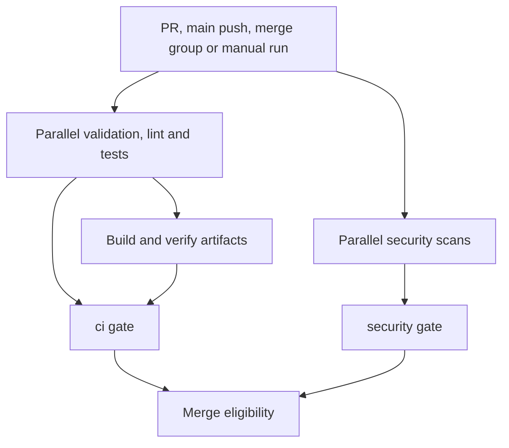

# CI

CI is the source of truth for whether this repository is correct. Everything a reviewer
would otherwise check by eye — that a skill validates, that its reference files exist,
that it is listed in the marketplace, that no secret is in history — is a job that either
passes or does not. `ci.yml` and `security.yml` gate every change. `scheduled.yml` runs
the checks that need the network or a wordlist, weekly. `evals.yml` scores trigger
evals — monthly over everything, and on every pull request over what that pull request
touched. `dependabot-auto-merge.yml` merges a Dependabot pull request once the two
gates have, `ci-triage.yml` explains a failed CI or Security run in one comment,
`release.yml` publishes a tagged release and then deploys that catalogue to Cloudflare,
`cut-release.yml` creates that tag from the Actions tab and hands it to `release.yml`,
and `deploy.yml` dry-runs that upload on a pull request and uploads a `stage` Preview of
the same Worker on a push to `stage`. None of `dependabot-auto-merge.yml`, `ci-triage.yml`, `cut-release.yml`, `release.yml` or
`deploy.yml` is a required check.

## Execution flow

Validation, lint, compatibility tests and security scans run in parallel. Packaging
starts only after every CI check succeeds, then builds and verifies the skill archives
and portable exports. `ci` and `security` remain the two required check names. Both reject
failed, cancelled, skipped, missing or malformed dependency results.



Artifacts are review outputs, not a deployment or release. Downloading them does not
prove the separate security workflow passed. Merge still requires both gates.

| Event | Required workflows | Cancellation |
| --- | --- | --- |
| Pull request opened, reopened or updated | CI and Security | A newer run for the same PR supersedes the older run |
| Pull request title, body or base branch edited | CI only | Does not cancel an in-progress CI run for that PR: the edit queues behind it in the group's one pending slot and then runs, so a description edited seconds after opening cannot turn the `opened` run's `ci` red by cancelling it. Security's existing result on the head commit stands, since `security.yml` does not list `edited`. |
| Push to `main` | CI and Security | Each run has its own concurrency group |
| Merge queue `checks_requested` | CI and Security | Each candidate run has its own concurrency group |
| Manual dispatch | CI and Security when dispatched individually | Each run has its own concurrency group |
| Weekly or monthly schedule | Existing advisory workflows | Existing advisory concurrency rules |

The merge-group trigger makes the checks available to a merge queue; it does not enable
a queue or change repository rules. Unique groups for non-PR runs also prevent a newer
pending run from replacing an older one. The cancellation policy applies only to
superseded PR checks. See GitHub's [merge queue requirements](https://docs.github.com/en/repositories/configuring-branches-and-merges-in-your-repository/configuring-pull-request-merges/managing-a-merge-queue)
and [concurrency behavior](https://docs.github.com/en/actions/writing-workflows/choosing-what-your-workflow-does/control-the-concurrency-of-workflows-and-jobs).

## `.github/workflows/ci.yml` — CI

Triggers on push to `main`; on a pull request opened, synchronized, reopened or edited
— `edited` is included because the naming and attribution jobs below check the title and
body, so changing either has to produce a fresh run; those two jobs read both from the
API when they run rather than from the event payload, which is frozen when the run is
triggered, and an edit does not cancel the run in flight (see the table above); on
merge-group `checks_requested`; and on `workflow_dispatch`. Top-level
`permissions: {}`; each job grants itself the minimum. Every tool the workflow installs
or downloads is pinned in the workflow-level `env` block — `CLAUDE_CODE_VERSION`,
`CODESPELL_VERSION`, `YAMLLINT_VERSION`, `PYTEST_VERSION`, `COVERAGE_VERSION`,
`PYTEST_XDIST_VERSION`, `PYTEST_COV_VERSION`, `ACTIONLINT_VERSION` and
`ACTIONLINT_SHA256` — for the reason the security section
gives, and at workflow level so a cache key can name one.

| Job | Check name | Failing means |
| --- | --- | --- |
| `validate-skills` | `validate skills` | A skill, a subagent, a command or the manifest is invalid: bad frontmatter, a name that does not match its directory or filename, a dangling `references/` pointer, a malformed eval set for a skill or a subagent, a `.claude/rules/` glob that matches nothing, or something on disk that no plugin lists. Runs with `--strict`, so a warning fails it too. Run `make validate` locally to see the same output; it also prints the per-plugin description total, which is the listing cost every installer pays. |
| `validate-plugin` | `validate plugin manifest` | `claude plugin validate .` rejected `.claude-plugin/marketplace.json`. The schema's source of truth is the definition inside the CLI itself, so this checks against the real thing rather than a copy that would fall behind. The CLI version is pinned in the workflow's `env` for the same reason the scanners are. |
| `test` | `test (3.10)` … `test (3.13)` | The full test suite failed on that interpreter. Every leg runs the suite on the runner's four cores through pytest-xdist; 3.13 additionally measures line and branch coverage in each worker through pytest-cov and enforces the unchanged floor in [`pyproject.toml`](../pyproject.toml). Compatibility remains checked on all four versions, with coverage instrumentation paid for once. pytest, pytest-xdist, pytest-cov and coverage are each pinned. The coverage table lands in the 3.13 job summary. |
| `catalogue` | `check catalogue` | A plugin's skill listing grew past its ceiling in [`listing-budget.json`](../listing-budget.json), the README stopped matching the tree, this file stopped listing the jobs CI runs, a workflow's aggregate stopped naming every job in it or a pinned version came to mean two things, the Makefile stopped wrapping the same commands the jobs run (or stopped parsing on an older `make`), a shell block or shipped script no longer parses, the hook registration in `.claude/settings.json` names a script that is missing or not executable, or the README's table of AI tools no longer matches [`providers.json`](../providers.json) or that file is malformed — regenerate the table with `make providers` rather than editing it; a row past `stale_after_days` only warns. The first is the one with no symptom: past the runtime's listing budget, the descriptions of a plugin's least-used skills are dropped, so they stay invocable by name and stop being chosen on their own. Ceilings carry a few hundred characters of slack, so rewording is free and adding a skill is a decision — raise one with `scripts/check_listing_budget.py --update` and say why in the commit. The same file also records each skill's own description length: a new skill must arrive at or under 900 characters, and one already above that is pinned where it measures rather than trimmed to fit a gate. |
| `package` (portable step) | `package` | `make portable` could not flatten every skill into a file that stands alone, or a router grew past `ROUTER_BUDGET_BYTES`. References are inlined and their pointers rewritten, so the export works without a filesystem; the router is checked against its byte budget before anything is written, so an oversized one fails the export rather than shipping quietly past what a terminal agent's own document budget allows. Portable outputs upload as `portable-skills` only after the preceding CI checks pass. |
| `spelling` | `lint spelling` | codespell found a likely typo. It ran weekly and warn-only until it was made a gate; the false positives are listed in [`pyproject.toml`](../pyproject.toml) with the reason each is one, which is what lets the check sit at zero and mean something. |
| `lint-markdown` | `lint markdown` | markdownlint-cli2 found a violation in a `*.md` file. Config in `.markdownlint-cli2.yaml`. |
| `lint-yaml` | `lint yaml` | yamllint in `--strict` mode found a problem. Config in `.yamllint.yaml`, version in `YAMLLINT_VERSION`: a release that adds a rule would otherwise redden the build on YAML nobody touched. |
| `lint-actions` | `lint workflows` | actionlint rejected a workflow. It also runs shellcheck over every inline `run:` block, which is where all of this repository's shell lives. The binary is downloaded at a pinned version and checked against a recorded digest before it runs. |
| `links` | `check links` | lychee found a broken link. It runs `--offline`, so only local paths are resolved — a relative link between documents, or from a document into the source tree, that does not exist. |
| `attribution` | `attribution` | [`scripts/check_attribution.py`](../scripts/check_attribution.py) found a Co-authored-by trailer, a footer or trailer naming a coding assistant, an assistant session link, a branch name prefixed for a tool rather than the change it makes, or a commit author or committer naming a coding assistant, in the pull request's own commits, branch name, title or body. It needs a base ref and pull request text to mean anything, so it only scans on a pull request, and there it reads the title and body from the API when the job runs, not from the event payload, which is frozen when the run is triggered — the job holds `pull-requests: read` beside `contents: read` for that read alone, and a failed read fails the job rather than passing as an empty body; a push to `main` or a merge-group run reports success without one, because those commits already passed this check on the pull request that produced them. It is not part of `make catalogue` for the same reason — there is no base ref to diff against outside a pull request — but `make attribution` reproduces the commit and branch checks against `origin/main` locally; the pull request title and body are checked only in CI, once the pull request exists. Whether the rest of a branch name matches `<type>/<short-kebab-description>` is `naming`'s row below, not this one — a tool-named branch still fails here first, since naming who wrote a change is attribution's job and the rest of the shape is a naming-convention question. |
| `naming` | `naming` | [`scripts/check_naming.py`](../scripts/check_naming.py) found a naming-convention violation: a skill directory, agent or command file, `references/*.md`, `evals/*.json`, Python module, workflow or doc whose name does not match its category's convention (checked against every file `git ls-files` tracks, not only what the pull request touched); a branch name that does not match the `<type>/<short-kebab-description>` shape; or, on a pull request, a commit subject or the pull request title that fails the rules [`CONTRIBUTING.md`](../CONTRIBUTING.md#commits) sets out, including the new 72-character cap. A merge commit and anything from Dependabot — by author or by a `dependabot/` branch — are exempt from the commit and title checks. File names are checked on every event; the branch, commit and title checks need a base ref and pull request text, so only a pull request supplies `--range`, the same reduced scope `attribution` gives a push or merge-group run. On a pull request the title is read from the API when the job runs rather than from the event payload, under the same `pull-requests: read` grant `attribution` holds. `make naming` reproduces the file-name, branch and commit checks against `origin/main` locally; the pull request title is checked only in CI, once the pull request exists. Code identifiers are a separate, existing gate: ruff's `pep8-naming` (`N`) rules run in `python security lint` in `security.yml`, because that check only ever sees Python and this one would just reimplement it. |
| `package` | `package` | `scripts/package_skills.py` could not build a `.skill` archive for every skill, or an archive it built is not loadable. It refuses to package a skill that does not validate, so this failing after `validate-skills` passed means a packaging problem, not a content one. Each archive is then opened and checked for a `SKILL.md` at its root whose `name` matches the archive, because building without error only proves a zip was written — a broken layout would ship green and fail at install, for someone else. The archives upload as the `skills` artifact. |
| `ci` | `ci` | Any dependency listed in its own `needs:` did not report exactly `success`, or the result payload did not match the expected jobs. A skipped package after a failed prerequisite also fails this gate. |

`validate-skills` runs `PYTHONPATH=src python -m skillcheck . --strict`, the same
invocation as `make validate`. The flag is the point: without it, a description one edit
from the 1024-character cap, a skill with no trigger clause, and a skill with no eval set
all report and pass. They are warnings because each is a judgement call rather than a
rule, and they fail the build anyway, because a warning nobody has to clear is a warning
that accumulates until the whole category is ignored.

`validate-plugin` runs without `--strict`, and that is deliberate: each
`plugins/<name>/.claude-plugin/plugin.json` omits `version`, which the CLI warns about —
one warning per plugin. With a git-sourced marketplace, omitting the version is the
documented behaviour — every commit then resolves as a new version — so those warnings
are the correct state and `--strict` would force a version field that exists only to
silence them. Releases are cut as git tags instead, described below in [releasing a
version](#releasing-a-version); the manifests still carry no `version` field, and pinning
to a release means pinning to the tag, not to anything in a manifest.

## `.github/workflows/security.yml` — Security

Same triggers, same empty top-level `permissions`. Tool versions are pinned in `env`
(`GITLEAKS_VERSION`, `GITLEAKS_SHA256`, `ZIZMOR_VERSION`, `RUFF_VERSION`) rather than
floated: a scanner that changes its rule set between runs turns a green build into a
statement about the scanner rather than about the code. ruff is in that list for a
concrete reason — 0.16 began formatting Python blocks inside Markdown, so an unpinned
upgrade would fail the build on skill prose that was green the day before.

| Job | Check name | Failing means |
| --- | --- | --- |
| `secrets` | `secret scan` | gitleaks found a credential. |
| `workflows` | `workflow audit` | zizmor found a workflow vulnerability at medium severity or above. |
| `python` | `python security lint` | `ruff check` or `ruff format --check` failed. |
| `codeql` | `codeql` | CodeQL's `security-extended` query suite found something in the Python source. |
| `permissions-audit` | `permissions audit` | A workflow has no top-level `permissions:` block, or one that is `write-all`, `read-all`, or grants `write` on any scope; an action is not pinned to a SHA; a job sets no `timeout-minutes`; or an `actions/checkout` does not set `persist-credentials: false`. |
| `security` | `security` | Any of its five dependencies did not report exactly `success`, or the result payload did not match the expected jobs. |

### The security jobs in detail

**gitleaks runs twice, over different things.** `gitleaks dir .` scans the working tree;
`gitleaks git .` scans history, which is why the checkout uses `fetch-depth: 0`. Scanning
only the working tree misses the case that matters most: a secret that was committed and
later removed is still a leaked secret, because the object is still in the repository and
anyone who cloned it has a copy. Both invocations use `--redact` so the finding does not
put the secret in the log. The binary itself is downloaded at the version in
`GITLEAKS_VERSION` and checked against `GITLEAKS_SHA256` before it is unpacked, for the
reason the pinning section below gives: a release asset is as mutable as the tag naming
it, and a secret scanner is a poor thing to run an unverified download of.

**zizmor audits the workflows themselves.** Run as
`zizmor --persona=regular --min-severity=medium .`. It looks for the things that actually
compromise a repository through CI: template injection into `run:` blocks, over-broad
token permissions, unpinned third-party actions, and `pull_request_target` combined with
a checkout of untrusted code.

**ruff carries the flake8-bandit rules, and pep8-naming.** `[tool.ruff.lint]` selects
`S` and `N` alongside `E`, `F`, `I`, `UP`, `B` and `SIM`. `S` is flake8-bandit, so the
security lint is the same tool as the style lint with two more rule sets enabled. `N` is
`pep8-naming` — the code-identifier quarter of the naming lint, alongside `naming`'s file,
branch and commit checks in `ci.yml` — and runs here rather than in its own job because it
only ever sees Python. `tests/*` ignores `S101`, because asserting is what tests do.

**CodeQL** runs `github/codeql-action` init and analyze with `languages: python` and
`queries: security-extended`. It is the only job that needs `security-events: write`.

**Four shell invariants.** `permissions-audit` is four `grep` and `awk` loops,
deliberately not a tool. Each is one of the workflow conventions `AGENTS.md` states, and
each exists because breaking it is silent:

- Every workflow file must set a top-level `permissions:` block that grants nothing. An
  absent block means jobs inherit the repository default, which is often read and write
  on everything — checking only that a `permissions:` line existed once let
  `permissions: write-all` through with the same silent, permanent effect, so the check
  also rejects that shorthand, its `read-all` sibling, a single-line flow map granting
  `write` on any scope (`{contents: write}`), and the block form of the same thing,
  quoted or not (`write`, `"write"` or `'write'`). A trailing comment on the
  `permissions:` line is stripped before it is judged — otherwise
  `permissions:  # least privilege` read as a value rather than as the empty,
  block-form line it is — and a comment at the start of a line inside the block no
  longer ends the scan before the grant on the line after it is read.
- Every action must be pinned to a commit SHA. The check is inverted rather than
  matching known-bad shapes: a ref that is not forty hex characters fails, whatever it
  looks like. Matching `@v1.2`, `@main` and `@master` let the likeliest regression
  through, which is pasting a tag over the SHA and leaving the `# v7.0.1` comment behind.
- Every job must set `timeout-minutes`. Without one a hung job runs to the six-hour
  platform default, which reads as slow CI rather than broken CI and holds a runner the
  whole time. Jobs are found as the two-space keys under `jobs:`, and a file the walk
  found no job in fails rather than passing — a parse that silently matches nothing is
  the failure this job exists to prevent.
- Every `actions/checkout` must set `persist-credentials: false`, including a checkout
  with no `with:` block at all. The `awk` walk is cross-checked against a plain `grep`
  count of the checkout steps, so a file whose shape it does not understand fails
  instead of reporting a clean run over steps it never saw.

The last two held by habit until they were gated. Both were correct across all twenty
jobs and eighteen checkouts on the day the check landed, which is the point: a ratchet
goes on while the invariant is true, not after it has already been broken.

## `.github/workflows/dependabot-auto-merge.yml` — Dependabot auto-merge

Triggers on `pull_request` (`opened`, `synchronize`, `reopened`), never
`pull_request_target` — the base-branch checkout and secret exposure that trigger allows
is exactly what zizmor's dangerous-triggers audit exists to catch, and nothing here needs
it. Top-level `permissions: {}`; the one job grants itself `contents: write` and
`pull-requests: write` (`release.yml`'s `release` job and `cut-release.yml`'s job also hold `contents: write`, and
`codeql`
in `security.yml` also writes, but only `security-events`, to publish its scan
results, not to change anything a person reads as the repository's content).
`ci-triage.yml`'s job also holds `pull-requests: write`, but spends it only on the one
triage comment and the `ci-failed` label, never on merging or pushing anything. Not a
required check — it names no other job and has no
aggregator, the same as `scheduled.yml` and `evals.yml` — because nothing depends on it
and the two gates that do matter, `ci` and `security`, do the deciding. A `concurrency:`
group keyed on the pull request number, with `cancel-in-progress: true`, cancels a stale
run when a newer push arrives for the same pull request; the job is idempotent, so
nothing is lost by cancelling one that was still enabling auto-merge.

A human push to a Dependabot pull request — a person amending the branch by hand — keeps
it eligible: `github.event.pull_request.user.login` stays `dependabot[bot]` regardless of
who pushed the newest commit, since it names who opened the pull request rather than who
last touched it. Those commits still have to clear `ci`, `security` and `attribution`
before the ruleset lets anything merge, the same as every other commit on the branch.

| Job | Check name | Failing means |
| --- | --- | --- |
| `auto-merge` | `dependabot auto-merge` | `dependabot/fetch-metadata` could not read the pull request, or `gh pr merge --auto --squash` failed after auto-merge was confirmed enabled — a conflict, a branch protection change, or a transient API error. A major-version pull request that skips because its update-type is not patch or minor, and a repository with auto-merge left disabled in Settings, are not failures: the job says so in a warning annotation and a step-summary line and exits 0. |

The job only proceeds for a pull request opened by `dependabot[bot]` whose head branch
lives in this repository — `user.login`, not `github.actor`, because the actor is
spoofable and the login is what zizmor's bot-conditions check recommends; the
`head.repo.full_name` comparison is what actually excludes a fork, since a constant
`github.repository == 'owner/repo'` matches every pull request including one from
outside. `dependabot/fetch-metadata` reports the highest semver level across every
dependency a grouped pull request touches, and reports nothing it cannot classify, so the
gate lists exactly what is allowed — patch or minor — rather than excluding major, which
a null result would then pass.

Merging with `GITHUB_TOKEN` does not trigger a push-triggered workflow on `main`, so this
does not chain into another `ci` or `security` run; the pull request's own checks, already
required by the ruleset and already green, are what gated the tree the merge produces. If
the pull request is already mergeable by the time this job runs, `gh pr merge --auto`
merges immediately rather than waiting — still safe, because mergeable means the required
checks already passed against this pull request merged onto the current tip of `main`,
which the ruleset's strict mode guarantees.

## `.github/workflows/ci-triage.yml` — CI triage

Triggers on `workflow_run` for `CI` or `Security` completing, guarded by a job-level
`if: github.event.workflow_run.event == 'pull_request'` so a push or merge-group run of
either workflow does nothing here. `workflow_run` always runs the workflow file already
on the default branch rather than the one at a pull request's head, so **this only
starts working once this file itself has been merged to `main`** — a pull request that
only adds it triggers nothing.

Top-level `permissions: {}`; the one job grants itself `actions: read`, `contents:
read`, `issues: write` and `pull-requests: write` — the third bounded exception
`AGENTS.md`'s Security considerations names, never `contents: write`, and nothing
pushed. A live run's first write, the comment POST, returned a 403 under the narrower
`issues: write` plus `pull-requests: read` grant a documentation-only reading of
GitHub's endpoints had left it with; the run never reached the label POST.
`GITHUB_TOKEN` needs `pull-requests: write` to comment on or label a pull request, and
separately needs `issues: write` to create the `ci-failed` label the first time any
pull request needs it, since the label does not exist until then. Both grants are
spent only on that one comment and that one label. `workflow_run` can hold a write
token even when the run that triggered it came from a fork, so the checkout takes only
the default branch, sparsely, for `scripts/`, and never the pull request's head; job
and step names read back out of the API do come from a workflow file at that head, so
`scripts/ci_triage.py` treats them as untrusted text and escapes them before they
reach the comment it writes. zizmor's dangerous-triggers audit flags any
`workflow_run` trigger regardless of what a job does with the privilege, so the `on:`
block carries this repository's first suppression, `# zizmor:
ignore[dangerous-triggers]`, reasoned through in the workflow's own header comment.

| Job | Check name | Failing means |
| --- | --- | --- |
| `triage` | `triage` | `scripts/ci_triage.py` raised `GitHubAPIError` — any GitHub API response outside 200-299 that the call did not ask to tolerate. The one tolerance is a 404 removing the `ci-failed` label, since the label already being gone is the outcome being asked for; every other call, read or write, fails the job rather than being read as an empty or successful result. Not a required check and has no aggregate, the same as `dependabot-auto-merge.yml`, `scheduled.yml` and `evals.yml` above and below: nothing depends on whether a pull request gets a triage comment. |

It recomputes the whole picture from the API for the pull request's current head SHA
rather than trusting the single event that woke it: GitHub keeps at most one pending
run per concurrency group and cancels the rest, so an event can be dropped, and
recomputing makes any surviving run correct regardless of what was lost. `CAUSES` in
the script is a table keyed on this repository's own job display names — the local
command each failure suggests, and a link to that job's section on this page.
`tests/test_ci_triage.py` parses `ci.yml` and `security.yml` directly and fails if a
job exists with no entry, so a job added without updating the table is caught rather
than rendering "unclassified" in a live pull request comment.

The transport also refuses to follow a redirect: the `Authorization` header carries
this job's live token, scoped to `api.github.com` by the script's own URL check, and
nothing about a 3xx response re-validates where it points before following it would
resend that same header off this host. A redirect is treated as any other non-2xx
response instead.

## `.github/workflows/release.yml` — Release

Triggers on a tag push matching `vX.Y.Z`, and on `workflow_dispatch`, which takes no
inputs and is what [`cut-release.yml`](#githubworkflowscut-releaseyml--cut-release) sends
after creating the tag through the API: a tag made with `GITHUB_TOKEN` does not start the
tag-push trigger, and a dispatch is one of the two events (with `repository_dispatch`) a
`GITHUB_TOKEN` call does start. A
dispatch starts the workflow at whatever ref it is pointed at, so the first step of both
jobs fails unless `GITHUB_REF_TYPE` is `tag` and `GITHUB_REF_NAME` is `vX.Y.Z`; a dispatch
on a branch publishes nothing. A dispatch on an older tag redeploys that version, which
makes it a deliberate rollback by redeploy. Top-level `permissions: {}`. The
`release` job grants itself `contents: write` — the second exception to "nothing here
pushes from CI", alongside `dependabot-auto-merge.yml`'s job. It is bounded three ways:
it only runs on a version-tag ref, it refuses a tagged commit that is not an ancestor
of `main`, and the write access is spent on creating a release and uploading assets
through the preinstalled `gh` CLI, never on pushing a commit — its checkout still sets
`persist-credentials: false`. The `cloudflare` job grants itself `contents: read` only.
It runs after `release` has succeeded, so a tag that fails validation never reaches
Cloudflare, and its token comes from the `production` environment rather than the
repository. See [releasing a version](#releasing-a-version) for the two-step procedure
that gets a tag onto `main` in the first place, and the deploy section below for the
secret that job needs before the first tag.

| Job | Check name | Failing means |
| --- | --- | --- |
| `release` | `release` | The ref is not a `vX.Y.Z` tag, the tagged commit is not on `main`, the strict validator failed, [`scripts/release.py notes`](../scripts/release.py) found no non-empty section in [`CHANGELOG.md`](../CHANGELOG.md) for the tag, [`scripts/package_skills.py`](../scripts/package_skills.py) or [`scripts/verify_archives.py`](../scripts/verify_archives.py) failed, [`scripts/export_portable.py`](../scripts/export_portable.py) failed, or `gh release create` or `gh release upload` could not create the release or upload an asset. |
| `cloudflare` | `cloudflare` | The ref is not a `vX.Y.Z` tag, the tagged commit is not on `main`, [`scripts/build_catalogue_site.py`](../scripts/build_catalogue_site.py) or [`scripts/check_wrangler_pin.py`](../scripts/check_wrangler_pin.py) failed, `npm ci` failed, the `production` environment has no `CLOUDFLARE_API_TOKEN` or `CLOUDFLARE_ACCOUNT_ID`, `wrangler deployments status` could not read the version production is serving or found traffic split between versions, `wrangler deploy` failed, Wrangler reported no `workers.dev` address or did not report `https://ai.szolotov.com` for the deploy, the smoke test did not see this version answer on `workers.dev`, `wrangler deployments status` does not show this version serving all traffic, or the automatic rollback failed. A 403 from `ai.szolotov.com` is logged as a notice and never fails the job. |

Not a required check — nothing merges against it, and it only ever runs after a `vX.Y.Z` tag
already exists. `git merge-base --is-ancestor "$GITHUB_SHA" refs/remotes/origin/main`
is what keeps a tag pushed at a branch commit from publishing anything: `GITHUB_SHA` is
the tagged commit on a tag-push event, and the check fails before anything is built if
that commit never reached `main`. The strict validator then repeats what the tagged
commit's own pull request already passed — not new information, but a release published
from a state this workflow never itself checked would be a hope rather than a guarantee.

The archives and the portable export are built exactly as `ci.yml`'s `package` job builds
them, calling the same two scripts, so the two paths that ship a `.skill` archive cannot
drift against each other. `python -m zipfile -c` zips `dist/portable` into
`dist/portable-skills-<tag>.zip` from inside `dist/`, so the archive's own top-level entry
reads `portable/…` rather than `dist/portable/…`.

The last step is written to be safe to re-run. `gh release view "$TAG"` decides which of
two things happens: if the release does not exist yet, `gh release create "$TAG"
--verify-tag` makes it, attaching the notes file the earlier step wrote and refused to
proceed on empty, along with every `.skill` archive and the portable zip. If the release
already exists — the shape a re-run after a partial failure takes, such as the release
having been created but an asset upload failing partway through — `gh release upload
"$TAG" --clobber` replaces its assets instead, overwriting anything a failed earlier
attempt managed to upload rather than erroring on "already exists" or leaving a stale one
behind. Re-running the workflow on the same tag is therefore the recovery procedure for a
failed run; nothing about it is destructive to a release that already succeeded, since
the assets it rebuilds are deterministic from the tagged commit.

No dependency caching: `setup-python`'s `cache:` key would restore whatever an earlier,
less trusted run wrote, on the one workflow with write access to the repository and about
to publish a release — zizmor's cache-poisoning audit flags exactly this on a
tag-triggered workflow.

The `cloudflare` job builds the same catalogue again and uploads it to the Worker
`ai`, which `deploy/wrangler.json` serves at `https://ai.szolotov.com` and on its
`workers.dev` host. It does not run when
`release` failed, and a re-run of the workflow is safe: the release job replaces assets that are already there, and Wrangler replaces
the Worker version.

The release is not smoke-tested by fetching `ai.szolotov.com`. Bot Fight Mode is on for
the zone `szolotov.com` and answers a GitHub runner's `curl` with HTTP 403. Cloudflare
documents that no WAF rule can skip it, and the only exception, an IP Access rule that
matches first, would mean allow-listing GitHub's address ranges, which are shared with
anyone who runs code there. It stays on. A Worker is zoneless and its `workers.dev` host
sits outside the zone, so the checks go there, in this order:

1. [`scripts/read_wrangler_deploy.py`](../scripts/read_wrangler_deploy.py) reads the
   deploy log. The job fails if there is no `workers.dev` address, or if the log does not
   list `ai.szolotov.com (custom domain)` as a target, because then this deploy did not
   attach the custom domain. Wrangler writes a custom-domain target as the bare host
   followed by that marker and its flags, for example `ai.szolotov.com (custom domain)
   [previews: enabled]`, and puts `https://` on `workers.dev` targets only, so the script
   matches that form and prints `custom_url=https://ai.szolotov.com`; a plain route or a
   look-alike host does not count.
2. [`scripts/smoke_site.sh`](../scripts/smoke_site.sh) checks the `workers.dev` address:
   `version.txt` equals the tag, then the manifest, `/` and the archive.
3. `wrangler deployments status --json`, read through
   `read_wrangler_deploy.py --active-is`, must show the version this deploy created
   serving 100% of traffic. One deployment is the active one on every address of a
   Worker, so the version that passed on `workers.dev` is the version the custom domain
   serves. This is a read of the API, not a fetch through the zone.
4. One request for `https://ai.szolotov.com/version.txt` is made for the log only. It
   prints the status, with a notice naming Bot Fight Mode on a 403, and can never fail
   the job.

That makes `workers_dev` in `deploy/wrangler.json` load-bearing: it must stay `true`,
because turning it off removes the address the release is verified on. A `DEPLOY_URL`
variable is no longer smoked, since it names a host in the zone; it only sets the
environment's link.

Before deploying, the job reads the version production is serving
with `wrangler deployments status --json`, and
[`scripts/read_wrangler_deploy.py --active`](../scripts/read_wrangler_deploy.py) keeps its
ID. A failure of any check above, including the active-version check, rolls back to exactly that version: `wrangler rollback` with no
ID picks the version uploaded before the newest one, which after an earlier failed
release is that failed release. A deployment that splits traffic between versions has no
single version to return to, so the job stops before deploying until the rollout is
finished or reverted, and it also stops if it cannot read the serving version at all.
The first deploy to an empty Worker has nothing to roll back to, so a smoke failure on
that first run leaves the job red and says so.

## `.github/workflows/cut-release.yml` — Cut release

Triggers only on `workflow_dispatch`, with one required input, `version` (`X.Y.Z`).
Top-level `permissions: {}`. The one job, `cut`, grants itself `contents: write` and
`actions: write` — the fourth exception to "nothing here pushes from CI". The first is
spent on creating one annotated tag object and the `refs/tags/vX.Y.Z` ref that points at
it, through `gh api`; it never pushes a commit, and the checkout sets
`persist-credentials: false` and keeps no credential. The second is spent on dispatching
`release.yml` on that tag, and on nothing else. It is bounded by when it runs: its first
step fails on any ref but `main`, before checkout and before either grant is used, so a
dispatch from another branch is visibly refused. It is a failing step rather than a
job-level `if` because a skipped job reports success. The `version` input reaches the job
only through `env:`, is matched against `^[0-9]+\.[0-9]+\.[0-9]+$` before anything uses
it, and is never interpolated into a `run:` block. Runs are serialised by the
`cut-release` concurrency group without cancelling one in flight.

It does not publish. The `production` environment admits only `v*` tags (step 4 of
[what you set in GitHub and Cloudflare](#what-you-set-in-github-and-cloudflare)), so a run
on `main` could not deploy; `release.yml` has to run on the tag, and it does because this
job dispatches it there. Everything `release.yml` checks, including that the tagged
commit is an ancestor of `main`, therefore applies to a tag cut here exactly as it does to
one pushed by hand.

| Job | Check name | Failing means |
| --- | --- | --- |
| `cut` | `cut` | The run is not on `main`, the version is malformed, [`scripts/release.py check`](../scripts/release.py) refused it (no non-empty section in [`CHANGELOG.md`](../CHANGELOG.md), the tag already on `origin`, a version not greater than an existing tag, or `HEAD` not equal to `origin/main`), the API refused to create the tag object or the ref, or `release.yml` could not be dispatched. In the last case the tag exists: dispatch Release on it with `gh workflow run release.yml --repo greenblacked/AI --ref vX.Y.Z`, the command the failed step prints, rather than cutting again. |

Not a required check — nothing merges against it. The tag message is the changelog
section, sent to the API as a JSON string built by Python so it arrives verbatim, with
its `###` subheadings intact; the tagger is the user who dispatched the run.

## `.github/workflows/deploy.yml` — Cloudflare

Runs on every pull request, on a push to `stage`, and on `workflow_dispatch`. Top-level `permissions: {}`.
Neither job grants itself more than `contents: read`. Not a required check.

| Job | Check name | Failing means |
| --- | --- | --- |
| `dry-run` | `dry-run deploy` | The site did not build, the Wrangler pin disagreed with [`deploy/package-lock.json`](../deploy/package-lock.json), or `wrangler deploy --dry-run` rejected the Worker. No credential is read. The job does not run on `workflow_dispatch`. |
| `preview` | `preview` | The run was not from `stage`, the `staging` environment has no Cloudflare credential, `wrangler preview` failed or reported no acceptable URL, or Wrangler did not report `https://stage.ai.szolotov.com` for the Preview. Stage is behind Cloudflare Access, so nothing on it is fetched. A Preview has no rollback and production is not touched, so the job stays red until the next push. The job does not run on a pull request. |

`dry-run` is the pull request. It builds `dist/site` with [`scripts/build_catalogue_site.py`](../scripts/build_catalogue_site.py)
and asks Wrangler to compile the Worker without uploading it. `--no-autoconfig` and
`--no-install-skills` are named because Wrangler 4's defaults would otherwise detect a
framework and can install agent skills into the checkout. The install is
`npm ci --ignore-scripts` from the lockfile, after [`scripts/check_wrangler_pin.py`](../scripts/check_wrangler_pin.py)
has required `WRANGLER_VERSION` to be the version both `deploy/package.json` and the
lockfile name. There is no package cache: a restored store is not what the lockfile
hashed.

`preview` runs on a push to `stage`, and on Run workflow from that branch only. It
runs `wrangler preview --name stage`, which uploads this commit as a Preview of the one
Worker `ai`, with `robots.txt` set to `Disallow: /`. A Preview is a separate version
that Cloudflare serves at its own URL: `https://stage.ai.szolotov.com` once the custom
domain `ai.szolotov.com` has Preview traffic enabled, and a `workers.dev` Preview URL
besides. Production traffic keeps running the version the last tag deployed; uploading
a Preview does not change it, and a Preview has no rollback because there is nothing to
roll back to. `wrangler preview` does not attach custom domains. Routes, including
`previews_enabled`, come from `wrangler deploy` (the first release applies
`deploy/wrangler.json`) or from the dashboard, which is why the first push to `stage`
before that is done fails with an error naming this section. If the Worker `ai` does
not exist yet, `wrangler preview` creates it first, with `workers.dev` on and no custom
domain or production deployment, so a Worker appearing after a push to `stage` is that
and not a stray production deploy.

[`scripts/read_wrangler_deploy.py --preview`](../scripts/read_wrangler_deploy.py) reads
the `preview` line Wrangler writes to `WRANGLER_OUTPUT_FILE_PATH` and keeps a URL only
when it is `https`, with no user, port, path or query, on a `workers.dev` host or at or
below `ai.szolotov.com`. Stage is behind Cloudflare Access, which serves its login page
on the `workers.dev` Preview URL and redirects `https://stage.ai.szolotov.com` to it, so
the job fetches nothing from stage. It checks through Wrangler and the API only: the
step fails if `wrangler preview` failed, if Wrangler reported no acceptable URL, or if
it did not report `https://stage.ai.szolotov.com` for the Preview. In the last case it
logs an error that the owner must enable `ai.szolotov.com` for Preview traffic.
`DEPLOY_URL` is not fetched.

[`scripts/smoke_site.sh`](../scripts/smoke_site.sh) retries `version.txt` until its
first line is the expected version, because a host can answer with the previous
version while the new one propagates. The wait is bounded by elapsed time, 90 seconds,
and no single request may outlast what remains of it, so a host that stalls cannot
push the release job past its `timeout-minutes`: a job that times out is cancelled, not
failed, and a cancelled release job would skip its rollback. On timeout it reports the
last version it saw.

### What you set in GitHub and Cloudflare

Do this once, before the first tag, or the `cloudflare` job fails after the GitHub
Release has already been created. Re-running the Release workflow retries the upload;
the release job is safe to repeat.

1. In the Cloudflare dashboard, open **My Profile → API Tokens → Create Token** (or
   **Manage Account → Account API Tokens**). Start from the **Edit Cloudflare Workers**
   template. Scope **Account resources** to the one account and **Zone resources** to
   the active `szolotov.com` zone in the same account. The token needs **Account /
   Workers Scripts / Edit**, and on the zone **Zone / Zone / Read**, **Zone / DNS /
   Edit** and **Zone / Workers Routes / Edit**: `wrangler deploy` creates the custom
   domain `ai.szolotov.com` with its DNS record and certificate. Keep **Account /
   Workers Tail / Read**, **Account / Account Settings / Read** and the user
   membership read the template includes; `wrangler deploy` and `wrangler rollback`
   call them. The template's Workers KV and R2 permissions are unused here and can be
   removed if the form allows. Validate the grants with a real deploy rather than
   narrowing them from documentation alone. Do not use the account's Global API Key.
   Set an expiry you will actually rotate.
2. Copy the **Account ID** from the Workers overview, or from the URL when the account
   is open. It is not a secret. It still should not be committed.
3. In this repository, **Settings → Environments**, create `production` and `staging`
   if they do not exist.
4. On `production`, set the deployment branch policy to **Selected tags** and add
   `v*`. Add the secret `CLOUDFLARE_API_TOKEN` and the variable
   `CLOUDFLARE_ACCOUNT_ID`. Do not also store the token as a repository Actions
   secret: a pull request from this repository can read a repository secret by editing
   the workflow, and an environment whose tags are only `v*` will not hand that token
   to a branch.
5. On `staging`, set the deployment branch policy to **Selected branches** and allow
   `stage` only. Add the same secret and the same account-id variable.
6. In the Cloudflare dashboard, open **Workers & Pages → `ai` → Settings → Domains &
   Routes** and enable `ai.szolotov.com` for **Production and Preview**, or let the
   first release apply `deploy/wrangler.json`, whose route sets `previews_enabled`.
   Until one of the two is done `stage.ai.szolotov.com` does not answer and the
   `preview` job fails with an error that says so. Delete any `stage.ai` DNS record
   created by hand: Cloudflare serves a Preview named `stage` from the domain's
   Preview wildcard, and a record of the same name would shadow it.
7. Protect the `stage` branch. Under **Settings → Rules → Rulesets**, add a branch
   ruleset targeting `stage` that requires a pull request, requires the `ci` and
   `security` status checks, and blocks force pushes and deletion. Keep the `staging`
   environment restricted to `stage` (step 5). Anyone who can push to `stage` gets a
   job that holds the Cloudflare token, and with one Worker that token can also deploy
   production: it is the same Worker, and the token's scope is the account and zone,
   not an environment. The earlier two-Worker layout kept a staging token away from
   production; this one does not, and the ruleset is the control that replaces that
   separation. A second token on `staging` needs the same Workers permissions to upload a
   Preview, so it does not narrow the risk. This is an accepted trade-off.
8. Optional, on either environment: variable `DEPLOY_URL`, an `https` origin with no
   path, shown as the environment's link. It is not smoked: a host in the zone answers a
   GitHub runner with Bot Fight Mode's 403. Production is verified on `workers.dev`
   whether or not it is set.
   Leave Bot Fight Mode on, and keep `workers_dev` set to `true` in
   `deploy/wrangler.json`. The release check goes through `workers.dev` and fails when
   Wrangler reports no such address.
9. Optional: required reviewers on `production` if you want a person to approve the
   tag deploy. With one maintainer that approval is a click on every release, so it
   is off unless you turn it on.

`make site` builds `dist/site` locally. `VERSION` defaults to `dev`.

What the build writes, besides the `.skill` archives, `portable-skills.zip`, the manifest,
`version.txt` and `robots.txt`: an `index.html` for the catalogue, one page per plugin under
`plugins/<plugin>/`, one per skill under `plugins/<plugin>/<skill>/`, and `start/`,
`workflows/`, `examples/` and `quality/`.
Every page is generated from the checkout with the standard library, Markdown included
([`scripts/site_markdown.py`](../scripts/site_markdown.py)) and the stylesheet
([`scripts/site_style.py`](../scripts/site_style.py)), so the dry-run and the deploy
need nothing installed to build it. The figures on `quality/` are read from the repository
at build time, and each section is left out when its source file is absent. Nothing is
written under `skills/` except archives: the tests assert that directory holds only the
`.skill` files.

## `.github/workflows/scheduled.yml` — Scheduled checks

Runs weekly (`cron: '0 6 * * 1'`) and on `workflow_dispatch`. Neither job gates
anything, and neither this workflow nor `evals.yml` has an aggregator, because an
aggregator exists to give branch protection a stable name to require and nothing
requires either of them.

| Job | Check name | Failing means |
| --- | --- | --- |
| `external-links` | `external links` | lychee could not reach an external URL. Hosts in `.lycheeignore` (example.com and friends, which appear inside skill instructions) are excluded. |
| `pin-freshness` | `pin freshness` | A `*_VERSION` in a workflow has no registry registered for it in [`scripts/check_pin_freshness.py`](../scripts/check_pin_freshness.py). A pinned tool version behind upstream, a registry that could not be asked, or `MARKDOWNLINT_PIN` in the [`Makefile`](../Makefile) no longer matching the markdownlint-cli2 the pinned action bundles is a warning annotation on a green run, not a failure. It reports and never bumps: adopting a version is the judgement the pinning exists to preserve. |

These are here because they depend on the network or a wordlist. A gate that fails
because someone else's site was briefly down is a gate people learn to override, and once
they learn that, the gates that matter stop working too.

`pin-freshness` is the answer to a gap the pinning created. Every tool CI installs or
downloads is pinned so that a green build is a statement about this repository rather
than about the day's release of a scanner — and Dependabot cannot move any of those
numbers, because its `github-actions` ecosystem updates `uses:` references and reusable
workflows and never reads an `env:` block. Without a weekly look, the version pins and the
markdownlint line in the `Makefile` sit where they are until somebody happens to wonder.
It asks PyPI, the npm registry and the GitHub releases API what the latest version is,
prints a table into the job summary, and stops there. Each pin that needs a look is also
a `::warning` annotation on the run, but the run stays green: Claude Code and Codex
publish nearly every week, and a weekly run that went red for each release was red
nearly every week, which teaches people to stop reading it.

## `.github/workflows/evals.yml` — Trigger evals

Three triggers: a monthly `schedule` (`0 7 1 * *`), `workflow_dispatch`, and
`pull_request`. There is no push trigger and, like `ci.yml`, no `paths:` filter — a
workflow skipped by a path filter leaves its check Pending forever, which is the failure
this repository refuses everywhere. Three jobs; the first two are guarded by a job-level
`if:` so that exactly one of them runs on any given event, and the third decides inside
itself whether the event is one it measures:

| Job | Check name | Failing means |
| --- | --- | --- |
| `evaluate` | `score descriptions` | The whole catalogue, on the schedule or on request; skipped on a pull request. A skill scored below the `threshold` input, or a dispatched run has no credential. Nothing depends on this job and no branch rule requires it. Two-hour timeout, because it makes one model call per query per sample. |
| `evaluate-changed` | `score changed skills` | Only on a pull request; skipped otherwise. A skill or agent the pull request changed, or one of its declared neighbours, scored below **0.7**. Forty-five-minute timeout. |
| `reviewer-benchmark` | `benchmark the reviewer` | A seeded defect in `.claude/agents/benchmarks/reviewer/` that `reviewer` does not catch, or a clean case it fails with a false alarm, below its thresholds. Runs on the schedule or on request, and on a pull request only when the cases, `reviewer.md` or the harness changed. Two-hour timeout. |

### `evaluate-changed`, the pull request job

`evaluate` measures the catalogue on a cadence. What it cannot do is tell the author of a
new skill that it has taken a neighbour's queries, because the score that reveals the
collision belongs to the neighbour: one skill merged at 95% while breaking the eval set
of the skill next door, and on a monthly cadence nobody would have known for a month.

So the pull request job scores changed skills and agents **and their declared neighbours**.
It reads distinct `expected` values from each changed target's eval set and resolves them
to skill directories under `plugins/*/skills/` or agent files under
`plugins/*/agents/` and `.claude/agents/`. Scoring only the changed target would not catch
the case above, because the changed target is the one that scores well.

What it does, in order:

1. Checks out with `fetch-depth: 0` so the base branch is reachable, and lists the
   changed files with `git diff --name-only "origin/${GITHUB_BASE_REF}...HEAD"`. Plain
   git rather than a changed-files action: this is one diff, and an action would be
   another pinned dependency in the supply chain for it.
2. Maps changed skill paths to their skill directory. Agent definitions under
   `plugins/*/agents/<name>.md` and `.claude/agents/<name>.md`, and their paired
   `evals/<name>.json` files, select that agent. Definition and eval changes select a
   target only once. Deleted definitions and orphaned eval sets are ignored; surviving
   definitions without eval sets are listed as unscorable in the summary. It adds the
   declared neighbours, deduplicates them against changed targets, and caps the list at
   twelve, with changed targets first. The summary counts only selected changed targets
   and neighbours and reports how many targets the cap dropped.
3. Runs [`scripts/run_trigger_eval.py`](../scripts/run_trigger_eval.py) once per target.
   The harness takes exactly one target per invocation and rewrites `--json` wholesale,
   so each target writes its own results file and the publish step merges them into one
   table — the same six columns the monthly job prints. The merged files upload as the
   `trigger-evals-changed` artifact.

Three outcomes that are green on purpose:

- **No scorable skill or agent changed.** The job reports success with a note in the summary rather than
  being skipped, so nothing sits Pending.
- **No credential.** A pull request from a fork is handed no secrets. The job says so in
  a notice and stands down, because a red check a contributor has no way to make green is
  a check everybody learns to ignore. The same is now true of the scheduled run of
  `evaluate`: a scheduled run skips with a notice, and only a dispatched run — where a person
  asked for a score and is owed the error — fails on a missing credential. A pull request
  from this same repository with no credential configured is a third case: it still
  stands down rather than failing, but the step emits a warning annotation and says
  scoring is inactive, rather than the fork's notice claiming something false of it.
- **A score between 0.7 and 0.8.** Reported in the summary and as a notice annotation,
  and advisory.

The floor is 0.7 rather than the 0.8 reporting bar because the measurement is sampled.
Run-to-run variance here is about five points — one skill read 85% and 90% on the same
tree — so a gate at 0.8 would fail on noise, and a gate that fails on noise is a gate
people learn to override, at which point the gates that matter stop working too. 0.7 sits
below the noise and still well above a description that has actually stopped working.
Anything under it fails the job with an error annotation naming the target.

An exit code of 1 from the harness means "below the reporting bar" and the job carries
on; anything higher means the harness itself failed — an unreachable model, a malformed
eval set — and stops the job with an error, because a run that cannot reach the model has
no score to report. The scores already paid for are published and uploaded either way.

### `reviewer-benchmark`, the quality benchmark

The trigger evals measure routing: whether a description gets a skill or subagent chosen.
They say nothing about what comes back once it is. `reviewer-benchmark` measures that for
the one subagent whose output quality the repository depends on most — whether a seeded
defect from [`docs/review-lessons.md`](review-lessons.md) is actually caught, and whether
an honest clean change is shipped rather than stalled on an invented objection.

Each case under [`.claude/agents/benchmarks/reviewer/`](../.claude/agents/benchmarks/reviewer)
is a small unified diff and a `case.json` describing it: a `"defect"` case passes when
`reviewer` returns `FIX` or `STOP` and every `must_mention` regex matches its report, and
a `"clean"` case passes on `SHIP`. The harness runs each case in an isolated `git
worktree`, detached from `HEAD`, and never touches the repository's own tree.

It runs on the schedule and on request, and on a pull request only when the diff touches
`.claude/agents/benchmarks/`, `.claude/agents/reviewer.md` or
`scripts/run_review_benchmark.py` — the three things a benchmark number depends on. A
pull request that changes none of them gets a green check with a note rather than the
expensive run; the job carries no job-level `if:` for the reason above, so a skipped run
never leaves a check Pending. The credential handling is `evaluate`'s: a scheduled run
stands down with a notice, a fork's pull request stands down, and a dispatched run fails
loudly. The harness's exit code is the job's: 1 is a rate below its threshold and 2 is the
harness failing to run at all, and the JSON is published and uploaded either way.

### Dispatch inputs

The seven inputs are shared by the workflow's jobs. Six belong to `evaluate`;
`evaluate-changed` takes none and always scores with the `claude` backend at three
samples per query; `reviewer` belongs to `reviewer-benchmark`. `skill` is marked required
and the others are not, but all carry a default, so dispatching the form unchanged scores
everything against Claude and does not run the benchmark:

| Input | Default | What it does |
| --- | --- | --- |
| `skill` | `all` | A skill directory such as `plugins/operations/skills/ci-triage`, a subagent file such as `plugins/operations/agents/ci-log-reader.md`, or `all` for everything that has an eval set. |
| `budget` | empty | A listing budget in characters. Set it to score descriptions the way the runtime shows them — the runtime's default is about 8,000 on a 200k model — rather than at full length. |
| `runs` | `3` | Samples per query; must be odd. A majority vote across them decides, which separates a description that genuinely fails from one sitting on the model's decision boundary. |
| `threshold` | `0.8` | Pass rate below which a target is reported as failing. |
| `backend` | `claude` | Which model CLI answers: `claude`, `codex` (OpenAI) or `gemini`. The job installs only that one, at the version pinned in the workflow's `env`. |
| `model` | empty | A model name passed to the CLI. Blank uses the CLI's own default. |
| `reviewer` | `false` | Also run `reviewer-benchmark`. Off by default because the benchmark costs a full review run per case, so a dispatch that only wants to re-score a skill does not pay for it. |

The harness reads no API key of its own. Each CLI reads the credential it expects, and
the first step checks that the chosen backend has one, stopping with a one-line annotation
if not, because failing there beats failing forty model calls later with a stack trace. A
dispatched run fails on an absent credential; a scheduled run and a pull request skip with
a notice instead, for the reasons above:

| Backend | Repository secret | Where it comes from |
| --- | --- | --- |
| `claude` | `CLAUDE_CODE_OAUTH_TOKEN`, or `ANTHROPIC_API_KEY` | The token is a subscription login: run `claude setup-token` on a signed-in workstation and store what it prints. No API key or billing account is needed. |
| `codex` | `OPENAI_API_KEY` | The OpenAI platform. Locally, a ChatGPT login through `codex login` is enough. |
| `gemini` | `GEMINI_API_KEY` | Google AI Studio. Locally, a Google login through the CLI is enough. |

`evaluate` then runs [`scripts/run_trigger_eval.py`](../scripts/run_trigger_eval.py) with
`--backend`, writes a table of pass rate, recall, specificity, routing and the count of
narrowly decided queries into the job summary, and uploads the full results as the
`trigger-evals` artifact. Each result records the backend and model it was scored with, so
a `--baseline` diff against a run on a different model is visible for what it is. Download
that artifact and pass it back as `--baseline` on the next local run to see what an edit
moved.

Neither job is a required check, and that is the design rather than an omission. A trigger
eval has two halves that cost different amounts. The schema — twenty queries, at least
eight on each side, no duplicates, `should_trigger` a real boolean — is deterministic and
free, so `validate-skills` checks it on every push. The score is sampled and costs money
per run, so what it gets on a pull request is a floor well under the reporting bar rather
than a required check: a required check that is occasionally wrong is a check people
learn to override, and once they learn that, the checks that matter stop working too.

What the run measures is discrimination rather than recall alone. Each query is put to the
model alongside the descriptions of every skill in the repository at once, so a skill
counts as having fired only when the model picks it by name out of that catalogue — which
means a description that fires on everything passes its positives and fails its negatives.
Three numbers come back per skill: pass rate over all queries, recall over the positives,
and specificity over the negatives. Reading them, and writing the queries in the first
place, is covered in [writing a skill](writing-skills.md).

## Releasing a version

A release is a git tag matching `vX.Y.Z` plus the [`CHANGELOG.md`](../CHANGELOG.md)
section it describes. The plugin manifests carry no `version` field either way — see
`validate-plugin` above — so a tag is what lets an installer pin to a release rather than
tracking the latest commit on `main`; [using the skills](using.md#updating-and-removing)
covers the install-time side of that.

`main` requires a pull request, so cutting a release is two steps, both wrapped by
[`scripts/release.py`](../scripts/release.py). The first is the same either way; the
second has two routes, and the Actions one is the usual path.

1. **On a branch:** `make release-prepare VERSION=x.y.z`. Moves `## [Unreleased]`'s body
   into a new `## [x.y.z] - YYYY-MM-DD` section dated today in UTC, leaves an empty
   `Unreleased` above it, and updates the compare-link footer at the bottom of the file if
   it carries one. It refuses an empty `Unreleased` section, a malformed version, and a
   version that is not greater than every version already in the changelog, already
   tagged locally, or — when an `origin` remote is configured — already tagged there,
   since a branch may not have fetched a tag another release just pushed; with no
   `origin` configured it says so and skips that one check rather than failing. Commit
   the result, open a pull request, and merge it.
2. **On `main`, after that pull request merges:** open Actions, choose Cut release and
   Run workflow on `main` with the version. It runs `scripts/release.py check`, which
   applies `tag`'s validation without the local-branch and working-tree checks — a
   non-empty changelog section, the tag not on `origin`, a version greater than every
   existing tag and `HEAD` equal to `origin/main` — creates the annotated tag through
   the API and dispatches `release.yml` on it; see
   [`cut-release.yml`](#githubworkflowscut-releaseyml--cut-release). The release and the
   deploy then run exactly as they do for a hand-pushed tag.

   The local route still works: `make release VERSION=x.y.z`, which
   checks things in this order: the branch is `main`; the working tree is clean,
   including untracked files; `CHANGELOG.md` has a non-empty `[x.y.z]` section; the tag
   does not already exist locally or on `origin`; and only then does it fetch and confirm
   `HEAD` matches `origin/main`. The tag-existence checks run before the fetch on
   purpose — fetching `--tags` pulls any tag `origin` already has into a local ref of its
   own, which would make the local check true for a tag this run never created and hide
   an "already exists on origin" refusal behind a misleading "already exists locally"
   one. Once every check passes it creates an annotated tag `vx.y.z` — with
   `--cleanup=verbatim`, so a `### Added`-style subheading in the section survives rather
   than being stripped as a comment line — whose message is that section's notes, and
   does not push: it prints `git push origin vx.y.z` as the last thing it does. Run that
   command to publish, which is what triggers `release.yml` above. That run creates the
   GitHub Release and, when the `production` environment has the Cloudflare credential
   from [the deploy section](#what-you-set-in-github-and-cloudflare), uploads the same
   catalogue to the `ai` Worker. The release is created first. A missing
   credential fails the deploy job and leaves the GitHub Release in place; fix the
   environment and re-run the workflow.

`scripts/release.py notes x.y.z` prints one version's section body and nothing else; it is
what `release.yml` writes into a file for `gh release create --notes-file`, and what a
maintainer can run by hand to preview a release's notes before tagging.

## Why the aggregator jobs exist

`ci` and `security` name every other job in their workflow in `needs:`, run
`if: always()`, and pass the dependency results to
[`scripts/check_job_results.py`](../scripts/check_job_results.py). The helper accepts
only a nonempty result set matching the expected job IDs, with every result exactly
`success`. Failure, cancellation, skipping, unknown statuses and malformed or missing
results all fail. Each gate writes a per-job result table to its summary without
printing dependency outputs. This gives branch protection a stable name to require.

The concrete problem: a matrix job's check name carries its parameters. The `test` job
appears as `test (3.10)`, `test (3.11)`, `test (3.12)` and `test (3.13)`. Requiring
`test (3.13)` works until someone drops 3.13 from the matrix or renames the matrix key,
at which point the required check never reports, and every pull request is blocked on a
check that no longer exists. A fixed-name aggregator does not have that property: the
jobs behind `ci` can change freely and the required check keeps the same name.

`if: always()` is load-bearing. Without it the aggregator can be skipped when a
dependency fails. GitHub treats a skipped job as successful for merge requirements, so
the aggregate must run and explicitly reject every non-success dependency. The workflow
checker also verifies the required aggregate's identity and result-check wiring; a
renamed or disconnected gate must not pass the repository's own checks.

Every workflow besides `ci.yml` and `security.yml` has no aggregator, because nothing
requires them. An aggregator exists to give branch protection a stable name to point at;
a workflow that gates nothing, or that runs once per tag rather than on every commit, has
no use for one. `scripts/check_workflows.py` is what actually enforces this: it looks for
a job carrying both `if: always()` and `needs:` in each workflow and treats one it finds
as that workflow's required aggregate, so this list is a summary of what it finds today
rather than the source of truth.

## Why there is no `paths:` filter

No workflow here has a `paths:` filter, and this is deliberate. `evals.yml` is the one
where the temptation is real — its pull request job has nothing to do unless a skill or agent
changed — and it runs on every pull request anyway, reporting when no changed target has
a trigger eval set to score in the job summary.

A workflow skipped by a path filter does not report a result at all — its check sits
Pending forever. If that check is required, the pull request can never merge, and the
only escape is an admin override. A job skipped by an `if:` condition behaves
differently: it reports success, and the pull request merges. The two look like the same
mechanism and are not.

This repository is small enough that running every required check on every change is
cheaper than the failure mode. Job-level skips are appropriate for the advisory eval
workflow, whose event and credential conditions are intentional. Required CI and
Security dependencies do not allow skips.

## Pinning, timeouts and checkout conventions

Every action is pinned to a full-length commit SHA with the version in a trailing
comment:

```yaml
- uses: actions/checkout@3d3c42e5aac5ba805825da76410c181273ba90b1  # v7.0.1
  with:
    persist-credentials: false
```

A tag is a mutable reference — the maintainer can move `v7`, and a compromised account
can move it to anything. A SHA cannot be moved. The trailing `# v7.0.1` comment is not
decoration: Dependabot parses it to identify which action version the SHA corresponds
to, and without it the SHA stops being updated. `.github/dependabot.yml` has the
`github-actions` ecosystem on a weekly schedule.

Comment the exact release tag, not the major. A `# v7` is true only until upstream moves
the floating `v7` tag to a newer commit, at which point the comment quietly describes a
different version from the one being run — and zizmor's `ref-version-mismatch` fails the
`security` gate for it. That is not a hypothetical: it is how `codespell-project/actions-codespell`
and `github/codeql-action` first broke here, months after being pinned correctly.

A tool downloaded rather than used as an action gets the same treatment as far as the
mechanism allows. `lint-actions` fetches a specific actionlint release and verifies it
against a recorded SHA-256 before running it, and `secrets` fetches gitleaks the same
way:

```yaml
run: |
  set -Eeuo pipefail
  archive="actionlint_${ACTIONLINT_VERSION}_linux_amd64.tar.gz"
  curl -fsSL -o "$archive" \
    "https://github.com/rhysd/actionlint/releases/download/v${ACTIONLINT_VERSION}/${archive}"
  echo "${ACTIONLINT_SHA256}  ${archive}" | sha256sum --check --status
  tar -xzf "$archive" actionlint
  ./actionlint -color
```

The upstream instructions are a `curl | bash` of a script on a moving branch, which the
`image-hardening` skill describes as adding an unreviewed commit author to your build.
A repository that publishes that advice should not run CI that way. Bumping the version
means bumping the digest beside it; if the two disagree the job fails before the binary
executes, which is the whole point.

`persist-credentials: false` is on every checkout. By default `actions/checkout` writes
the job's token into `.git/config`, where any subsequent step — including anything a
build script pulls in — can read it and push with it. None of these jobs push, so none of
them need the credential to survive the checkout step.

Every job sets `timeout-minutes` — five for most, ten for `validate-plugin`, `test`,
`package`, `cut-release.yml`'s job and the two `scheduled.yml` jobs, fifteen for the release job, twenty for
CodeQL, two hours for the monthly eval job, and forty-five for the pull request eval
job. The default is six hours, which is long enough that a hung step looks like a slow
one for most of a working day, and it holds a runner the whole time. A timeout turns
that into a failure with a name.

Both of those are enforced rather than remembered: `permissions-audit` fails the
`security` gate for a job with no `timeout-minutes` and for a checkout that does not set
`persist-credentials: false`. They were conventions held by habit for as long as the
workflows existed, and a convention held by habit is one the next job quietly skips.

The five jobs that install from PyPI cache `~/.cache/pip`, and `validate-plugin` caches
`~/.npm`. Each key names the job and then a hash of the file that records the pins, so
it busts whenever that file changes — every pin change, and also edits that change
nothing a cache holds. That over-busting is the deliberate side of the trade: the
alternative is a key naming each pinned version by hand, which is one more thing to keep
in step with the pins and to get wrong silently. There is no separate lockfile either
way. A branch also starts cold, because a cache is visible to the branch that wrote it,
its base and the default branch, so the first run of a new branch misses whatever `main`
has not published yet. The job name is load-bearing rather than decoration:
`setup-python`'s own `cache: pip` keys on the interpreter and the dependency file and
nothing else, so every job in a workflow running the same interpreter would share one
entry — the first to finish saves its wheels, and the rest restore a cache without
theirs and, because the key hit exactly, never save their own. `validate-plugin` needs
`actions/cache` for a different reason: the Claude CLI arrives through `npx` rather than
as a dependency, so there is no lockfile for `setup-node` to cache against, and the key
names `CLAUDE_CODE_VERSION` by hand instead.

CI and Security use pip supplied by the selected Python installation rather than
upgrading it to an unpinned release during every run. Direct tool dependencies remain
version-pinned; this does not claim that the hosted runner or every transitive package
is immutable.

## Validating or rolling back this flow

Run `make validate`, `make catalogue`, `make test` and `make coverage` locally. The
focused gate tests exercise skipped, failed, cancelled, missing and malformed results;
workflow tests check the required aggregate wiring. On a PR, verify all four Python
jobs, both aggregate summaries and the `skills` and `portable-skills` artifacts. A green
advisory trigger-eval job without credentials still means no routing score was measured.

No branch-protection migration is needed because `ci` and `security` keep their names.
To roll back, revert the CI redesign commit through a PR and require both existing
checks before merging. The extra artifact stage may lengthen the critical path; the
benefit is that packaging starts only after the checks pass, while the separate checks
continue to give early failure feedback. Runner-minute or wall-clock savings must be
measured from actual runs rather than inferred from job count.

Four jobs that fetch something are deliberately not cached. `lint-actions` and `secrets`
curl a single pinned tarball each and verify it against a digest, which is already about
as cheap as a cache restore and one fewer moving part in the path a binary reaches CI by.
Each curl retries up to three times on a transient failure, with a 20-second
connect timeout and a 60-second cap per attempt so a stalled connection fails well
inside the job's own timeout. `--retry-max-time 150` caps how long curl keeps
scheduling retries at all, including any wait a `Retry-After` header on a 429 or 503
response asks for: `--max-time` only bounds a single transfer, not the sleep between
attempts, so a server-requested delay long enough on its own could otherwise still run
past the job's five-minute `timeout-minutes` even though every individual attempt
respected its own cap. The digest check afterwards runs on whatever arrives,
retried or not, so a retry that succeeds is verified exactly as a first-try download
would be. The `evals.yml` jobs install a CLI globally with npm and are not on the
critical path of any gate.

## Making CI authoritative

The workflows only mean something if the checks are required. Until this ruleset
existed, none of them were: `ci` and `security` reported on every pull request and
nothing stopped a red one merging, which made every gate in this repository advisory and
`AGENTS.md`'s "do not push to the default branch directly" a statement rather than a
rule. The ruleset below is configured on `main` and is what changes that.

```bash
gh api --method POST /repos/greenblacked/AI/rulesets \
  --input - <<'JSON'
{
  "name": "default branch protection",
  "target": "branch",
  "enforcement": "active",
  "conditions": {
    "ref_name": { "include": ["~DEFAULT_BRANCH"], "exclude": [] }
  },
  "rules": [
    { "type": "deletion" },
    { "type": "non_fast_forward" },
    {
      "type": "pull_request",
      "parameters": {
        "required_approving_review_count": 0,
        "dismiss_stale_reviews_on_push": false,
        "require_code_owner_review": false,
        "require_last_push_approval": false,
        "required_review_thread_resolution": false
      }
    },
    {
      "type": "required_status_checks",
      "parameters": {
        "strict_required_status_checks_policy": true,
        "required_status_checks": [
          { "context": "ci" },
          { "context": "security" }
        ]
      }
    }
  ]
}
JSON
```

Five things to note. `~DEFAULT_BRANCH` is a symbolic target, so the ruleset follows the
default branch if it is ever renamed. `strict_required_status_checks_policy: true`
requires the branch to be up to date with its base before merging, which is what stops
two individually-green pull requests from combining into a red `main`. The `deletion` and
`non_fast_forward` rules block branch deletion and force-pushes.

The `pull_request` rule is what enforces the rule `AGENTS.md` states, and its review
count is zero on purpose. This repository has one maintainer, and GitHub does not let
anyone approve their own pull request, so a count of one would lock the only person who
can merge out of merging. Zero still forces the change through a pull request, which is
where the required checks run; it does not pretend a second pair of eyes exists. Raise it
the day a second maintainer does.

The API fills in three defaults the payload does not set: `required_reviewers: []`,
`allowed_merge_methods` with all three, and
`require_extra_approval_for_unattributed_changes: true`. The last one reads alarmingly
next to a review count of zero and is not: it applies to pull requests opened by Copilot
under its own app identity, so it cannot lock out a person.

There are no bypass actors, so the rules apply to the owner as well. That is the point —
a rule the person most likely to be in a hurry can step around is a rule for everybody
else. Add one to `bypass_actors` if an escape hatch is ever needed, and expect to explain
why in the commit that does it.

This requires repository admin. A workflow's `GITHUB_TOKEN` cannot create or modify
rulesets no matter what `permissions:` it is granted, so this is a one-time manual step
by an owner, not something to automate in Actions.

Verify with:

```bash
gh api /repos/greenblacked/AI/rulesets
gh api /repos/greenblacked/AI/rulesets/<id> --jq '.rules[].type'
```

A `[]` from the first command means the gates are advisory again, whatever the workflows
say.

## Settings no file here can see

The ruleset above is one of several controls that live in GitHub's settings rather than
in this repository. That is the whole difficulty with them: nothing in the tree records
their state, no gate reads them, and a repository can look rigorous while every control
it describes is switched off. That is not hypothetical here — the ruleset itself was
documented for weeks before anyone noticed it had never been created, and the paragraph
below about reporting a vulnerability named a form that was disabled.

This section is the record. Each row says what the setting decides and what silently
stops working without it.

| Setting | Decides | Without it |
| --- | --- | --- |
| The branch ruleset above | Whether `ci` and `security` are required, and whether `main` takes direct pushes | Every gate in this repository is advisory and a red build can merge |
| Private vulnerability reporting | Whether the advisory form `SECURITY.md` tells people to use exists | A reporter follows that instruction, finds nothing, and falls back to a public issue — which for a leaked credential is the outcome the document exists to prevent |
| Dependabot alerts, and security updates | Whether a published advisory against a dependency GitHub can read is surfaced, and a fix proposed. That excludes nearly everything this repository depends on today: GitHub raises an alert for an action only when it is referenced by a semantic version, not a commit SHA, and every action here is pinned by SHA; the tools CI installs are pinned in workflow variables, and GitHub parses only a workflow's `uses:` references as dependencies; `pyproject.toml` declares no runtime dependencies, and its one third-party package, the unpinned `hatchling` build backend, is fetched only when the validator is built or installed as a package, which CI never does, with no version update covering it | Nothing would flag a manifest dependency added later. For actions the outcome is the same either way: no alert reaches a SHA pin, so `.github/dependabot.yml`'s version updates — a different feature, which does follow a SHA pin through its version comment — are what keep a vulnerable action from staying in place |
| Required SHA pinning for actions | Whether the platform refuses a workflow referencing an action by tag | Only the `grep` in `permissions-audit` stands between a floating tag and a build, and it runs after the fact rather than instead of |
| Secret scanning, and push protection | Whether a credential is caught as it is pushed | gitleaks still catches it in CI, one step later and after it has left the machine |
| Default workflow token permissions | The floor every job's `permissions:` block narrows from | An absent block inherits write access rather than read |
| Delete branch on merge | Whether a merged pull request's head branch is deleted automatically | An unpruned branch list piles up, and a stale one is hard to tell from a live one |
| Code scanning setup on advanced, not default | That CodeQL runs from `security.yml`'s `codeql` job with the `security-extended` suite this repository configures, rather than GitHub's own default setup | GitHub documents that an advanced-configuration workflow's analyses cannot be processed while default setup is also enabled on the same repository, so turning default setup on risks the workflow's CodeQL uploads being rejected |

### Recorded state

Everything above is what a setting decides, not whether it is on. Secret scanning, push
protection, Dependabot alerts and Dependabot security updates are owner-confirmed, first
on 2026-09-26 and again on 2026-10-03: the repository owner checked them by hand, on the
Settings page under Security → **Advanced Security**, not through any command in this
repository. Nothing here re-checks them, because the API responses those four settings
live behind are hidden from a non-admin call.

Two settings do not rest on the owner's word, because the public API returns them to any
caller, so they are confirmed rather than merely reported. Delete branch on merge is on
(`gh api /repos/greenblacked/AI --jq '.delete_branch_on_merge'`). Private vulnerability
reporting is on, read back on 2026-10-03
(`gh api /repos/greenblacked/AI/private-vulnerability-reporting --jq .enabled` returns
`true`), so the advisory form `SECURITY.md` and `CODE_OF_CONDUCT.md` send reporters to
exists.

Code scanning is the one setting with a required value rather than an on or off. On
2026-10-03 the owner turned on GitHub's default setup alongside the `codeql` job, and then
chose to keep the job: it runs the `security-extended` suite this repository configures,
and GitHub documents that it does not process a workflow's CodeQL analysis while default
setup is also enabled, so with both on the job's upload is rejected and the required
`security` check can go red. Default setup
therefore has to stay off. Read it back with the `code-scanning/default-setup` command
below; `not-configured` is the required answer, and anything else is the conflict this
paragraph describes, not a stricter configuration.

For the branch ruleset, required SHA pinning and default workflow token permissions, this
section records no state — read each back with the commands below rather than assume this
page still matches what GitHub reports.

None of the settings confirmed above replace a check already documented in this file;
each sits alongside it. Push protection stops a credential at push time, and
gitleaks still scans the tree and history in CI exactly as before, one step later.
Dependabot alerts and security updates watch for a dependency GitHub can read, which
today is close to none: they skip an action pinned by SHA, as every action here is, and
the tools CI installs by pinned version in workflow variables. `pyproject.toml` declares
no runtime dependencies; its build backend, `hatchling`, is unpinned and outside every
update, but nothing here builds the package. `.github/dependabot.yml`'s version updates,
covered in the row above, remain the separate feature they always were, and for actions
the only one of the two that does anything.

Read the current state of all of them:

```bash
gh api /repos/greenblacked/AI/rulesets --jq '.[] | "\(.name) [\(.enforcement)]"'
gh api /repos/greenblacked/AI/private-vulnerability-reporting
gh api /repos/greenblacked/AI/actions/permissions
gh api /repos/greenblacked/AI --jq '.security_and_analysis'
gh api /repos/greenblacked/AI/vulnerability-alerts && echo "alerts enabled"
gh api /repos/greenblacked/AI --jq '.delete_branch_on_merge'
gh api /repos/greenblacked/AI/code-scanning/default-setup --jq .state  # not-configured is what this repository wants
gh api /repos/greenblacked/AI/actions/permissions/workflow --jq .default_workflow_permissions  # read is what this repository wants
```

And set the three that are a single call each:

```bash
gh api --method PUT /repos/greenblacked/AI/private-vulnerability-reporting
gh api --method PUT /repos/greenblacked/AI/vulnerability-alerts
gh api --method PUT /repos/greenblacked/AI/automated-security-fixes
gh api --method PUT /repos/greenblacked/AI/actions/permissions \
  -F enabled=true -f allowed_actions=all -F sha_pinning_required=true
```

All of these need repository admin, and a workflow's `GITHUB_TOKEN` cannot change any of
them whatever `permissions:` it is granted. They are owner actions, not something to
automate in Actions.

### The eval credential

`evals.yml` needs a model credential as a repository secret, and there is none. Each of
its jobs stands down rather than failing on a scheduled run and on a pull request, which
is right for a fork and for a check nobody is required to pass; only a run somebody
dispatched by hand fails on the missing credential, because they asked for it and are owed
the error. In practice the scoring has never run. Every pull request that reached the
credential step reported
`::notice title=no credentials::Not scoring the changed skills`, and the monthly run over
the whole catalogue will do the same.

So the trigger-eval machinery — the harness, the eval sets on every skill and subagent,
and the section of this document describing what the numbers mean — currently measures
nothing. The collision it exists to catch, one skill quietly taking a neighbour's queries,
has never been looked for.

One secret fixes it, and no API key or billing account is needed: run `claude setup-token`
on a signed-in workstation and store what it prints as `CLAUDE_CODE_OAUTH_TOKEN`.

```bash
gh api /repos/greenblacked/AI/actions/secrets --jq '.secrets[].name'
```

An empty result means the eval jobs are standing down on every run.

## Running the checks locally

```bash
make validate   # skills, subagents, commands, rules and the manifest — the validate-skills job
make catalogue  # listing ceilings, README and CI drift, workflows, the Makefile, shell, providers — the catalogue job
make portable   # flatten every skill for ChatGPT, Grok and other assistants
make test       # pytest -n auto — the test job
make coverage   # the same run under pytest-cov, failing below the floor
make lint       # ruff, markdownlint, yamllint, actionlint, codespell — the lint jobs
make lint-strict  # the same, but a missing or mis-versioned tool fails instead of skipping
make package    # .skill archives into dist/ — the package job
make attribution  # commits since origin/main and the branch name against the attribution rules — the attribution job
make naming     # file names, branch and commits against naming conventions — the naming job
```

`make validate` passes `--strict`, exactly as the job does, so a warning fails locally
before it fails in CI.

`make test` needs `pytest-xdist` installed alongside `pytest`, and `make coverage` also
needs `pytest-cov` and `coverage`; the floor is enforced by the `coverage report` that
follows the run, which also names the file that fell. The suite reaches the
scripts as well as the validator: the eval harness runs against a fake `claude` on
`PATH` that answers from a table, `install.sh` runs against a temporary target
directory, and the packager and the `PostToolUse` hook run against a small repository
built in a temporary directory. The floor is set below the measured figure on purpose.
It exists to catch a script sliding back to untested, which is the state the harness and
the packager were in before the suite covered them, not to be chased.

`make lint` skips a tool that is not installed and prints how to get it, so a partial
local toolchain does not block you; CI has all of them. `make lint-strict` is the same
run with that tolerance removed: a tool that is absent, or a `ruff` or `actionlint` whose
version is not the one CI pins, fails instead of warning. Use it when the point is to
reproduce CI rather than to get a quick local signal, because a tool a version behind can
pass a tree CI then rejects — ruff 0.16 formats Python inside Markdown fences and older
versions do not.

`make catalogue` needs nothing installed beyond `bash`. It is the eight checks that
keep the repository's claims about itself true — the per-plugin listing ceilings and
the two install claims they underwrite (which plugins fit the default budget, and the
`skillListingBudgetFraction` to set when they do not), whether
the README still lists every skill, subagent and command that exists and nothing that
does not, whether this file still lists every job CI runs, whether each workflow's
aggregate still names every job in it and each pinned version still means one thing,
whether the Makefile still wraps the same commands the jobs run, whether every shell
block and shipped script actually parses, whether the hook
registered in `.claude/settings.json` names a script that is there and executable, and
whether the README's table of AI tools is still what `providers.json` renders to.
Each failure is invisible without a gate: the first costs you the skills you use least,
silently; the second and third are only ever caught by someone reading; the fourth is the
worst of them, because a job left out of the aggregate makes the required check report
success while that job is red; the fifth is a claim about local equivalence nobody reads,
so `make` and CI drift apart in the direction of whichever was edited last; the sixth
ships a command that reads fine and fails in someone else's terminal; the seventh turns
the hook off, so skills are written unvalidated and the first sign of it is one reaching
CI weeks later; and the eighth leaves a hand edit to the table disagreeing with the data
and sources behind it. A row
nobody has re-checked within `stale_after_days` is a warning rather than a failure,
because a claim about someone else's tool ages whether or not anything here changed.
`.claude/settings.json` is read by the runtime and by nothing else here, which is why
the path in `command` needed a check of its own rather than a habit.

`check_pin_freshness.py` is not part of `make catalogue` either, for the same reason it
is not a gate: it needs PyPI, the npm registry and the GitHub releases API to answer. Run
it directly when you want to know what has moved, and give it a token if you are asking
more than a few times an hour:

```bash
GH_TOKEN=$(gh auth token) python scripts/check_pin_freshness.py .
```

The trigger evals are not part of `make`, because they need a model and a key. Run them
directly when a description is the thing in question:

```bash
python scripts/run_trigger_eval.py --skill plugins/operations/skills/ci-triage --verbose
```

The security tooling is not wrapped in a `make` target, because the versions are pinned
in the workflow rather than in the repository. Reproduce it directly, matching the
versions in `security.yml`:

```bash
python -m pip install "zizmor==1.30.1" "ruff==0.16.9"
zizmor --persona=regular --min-severity=medium .
ruff check .
ruff format --check .
```

## Reproducing a failure

1. **Read the annotations before the log.** The validator emits
   `::error file=…,line=…,title=<code>::…` so failures land on the right line of the
   diff, and writes a per-skill table into the job summary. ruff and yamllint both run
   with GitHub output formats for the same reason.
2. **Pull only the failed step's log** rather than the whole run:

   ```bash
   gh run view <run-id> --log-failed
   ```

3. **Match the interpreter.** A `test` failure names its Python version in the check
   name. Reproducing 3.10 on 3.13 is not reproducing.
4. **Re-run the exact command.** Every job in `ci.yml` is one command; the `make` targets
   above wrap the same invocations. `make validate` runs
   `PYTHONPATH=src python3 -m skillcheck . --strict`, which is what the job runs — down
   to the flag, so a warning that fails CI fails locally too.

`validate-skills` also reads `.claude/rules/`, which is loaded into the session rather
than shipped to installers. A rule scoped with a `paths:` glob loads only when Claude
reads a matching file, so a glob with a typo in it never matches, the rule never loads,
and nothing else would ever say so — `dangling-glob` and `empty-paths` are that failure
made loud. [Project structure](project-structure.md) has the rest of what the loader
picks up automatically.

For the reasoning behind the rules `validate-skills` enforces, see [writing a
skill](writing-skills.md). For the subagents referenced by the manifest, see [writing a
subagent](writing-agents.md).
